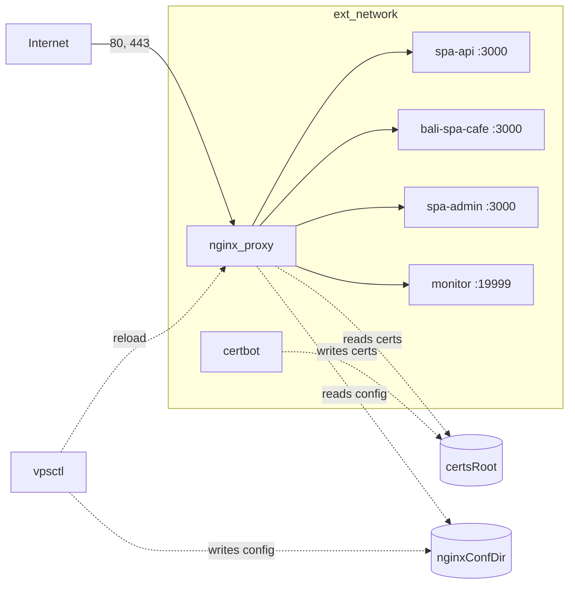

# Architecture

How the edge fits together, and why the parts that look strange are that way.
Most of what follows previously existed only as comments inside bash heredocs.

## The shape



`nginx_proxy` is the only container publishing ports. Everything else is reachable
only across the shared `ext_network`, by container name.

## Why upstream resolution dictates the whole design

**nginx resolves every upstream hostname when it loads its config, not when it
serves a request.** It does this even for upstreams no server block references.

So an upstream naming a container that is not on the network does not degrade one
site. It stops nginx from starting at all: the master exits before writing
`/run/nginx.pid`, and every subsequent `nginx -s reload` fails with
`invalid PID number ""`, which no amount of retrying resolves.

Reproduce it in one command:

```sh
docker run --rm -v "$PWD/rendered/conf.d":/etc/nginx/conf.d:ro nginx:latest nginx -t
# nginx: [emerg] host not found in upstream "spa-admin:3000"
```

The three deploy scripts this repo replaces each worked around it separately:

- starting app containers before nginx
- hand-omitting absent upstreams from `upstreams.conf`
- wildcarding the monitor include

`vpsctl` states the rule once instead: **before rendering a block, check the
upstream resolves; if not, leave it out and warn.**

That is also why each app's `upstream` block is declared in its own
`<name>-ssl.conf` rather than in the shared `upstreams.conf`. Dropping a site
block has to drop its upstream too, or the render leaves an upstream pointing at
nothing and nginx will not start. Keeping the two in one file makes that
structural: excluding the app removes the file, and the upstream goes with it.
There is no filter to get wrong.

`upstreams.conf` therefore holds only http-level globals and the `netdata`
upstream, which belongs to no app and is gated separately on the monitor
container resolving.

### Why the check resolves DNS instead of listing containers

`docker network inspect` reports container _names_. Docker's embedded DNS also
answers on network _aliases_. A container reachable as `spa-api` but named
something else is present as far as nginx is concerned and absent as far as
`network inspect` is concerned, so a name-based check would silently drop a
working site.

`vpsctl` resolves the hostname from inside the network instead, exactly as nginx
does.

## Why the /monitor/ snippet lives outside conf.d

nginx auto-includes `conf.d/*.conf` at **http** level, where a bare `location`
block is a syntax error. The Netdata dashboard is a `location`, shared by more
than one server block, so it lives in `snippets/` and is included explicitly.

Site blocks include it through a wildcard, `include /etc/nginx/snippets/monitor*.conf`.
A wildcard that matches zero files is not an error, which is what lets the whole
thing degrade cleanly when Netdata is not running: `vpsctl` omits both the
`netdata` upstream and the snippet, `/monitor/` stops resolving, and every site
keeps serving.

Without that, a stopped monitoring container would take down three production
sites.

## Why netdata uses bridge networking, not host

`network_mode: host` would give Netdata accurate host network-interface charts.
It would also put port 19999 on the server's public IP.

The stack uses bridge networking instead, so nginx can reach it as `monitor` and
19999 is never published. The trade-off:

| | |
|---|---|
| Cost | Interface charts show the container's interfaces, not the host's |
| If host NIC traffic is ever needed | Switch to host networking, firewall 19999, repoint the `netdata` upstream |

## Why netdata is so heavily privileged

`pid: host`, `SYS_PTRACE`, `SYS_ADMIN`, unconfined AppArmor, and a read-only mount
of `/`. Netdata needs all of it to report host processes, disks and per-container
metrics rather than just its own container.

That privilege is why `/monitor/` being reachable without authentication matters
more than a monitoring dashboard normally would. It is currently open to anyone
who can reach the site over HTTPS. Tracked in [known-issues.md](known-issues.md).

## Why config is validated before it is written

`apply` renders into a scratch tree, runs real nginx against it in a throwaway
container, and only then overwrites the live config. The scripts this replaces
wrote first and tested afterwards, which meant a template mistake reached the
running proxy before anything noticed.

The validator has to fake two things, because nginx resolves both at parse time:

| What | How it's faked |
|---|---|
| Upstream hostnames | `--add-host <container>:127.0.0.1` |
| TLS certificates | Generated self-signed inside the container. Only the cert _paths_ come from rendered config, and the parity gate covers those |

It runs `nginx -T` rather than `-t`, and asserts the rendered files appear in the
dump. That is not belt and braces: docker creates a missing bind-mount source as
an empty directory instead of failing, and nginx reports success on an empty
`conf.d`. Without the assertion, any path mistake turns the gate into an
unconditional pass, silently.

## Why there is a filesystem lock

Three pipelines deploy to one host and all of them reach the same config
directory. `vpsctl` takes a lock file before mutating anything.

The lock is created with `link()` rather than `mkdir()`, so it never exists
without its holder metadata. With `mkdir` there is a window between creating the
directory and writing the metadata inside it, and a second process arriving in
that window cannot tell whether the lock is one millisecond or one week old. It
must either steal it, which lets two applies run at once, or never reclaim it
after a crash. Hard-linking a fully written temporary file removes the choice.

The lock lives on the VPS rather than in CI, on purpose:

- A GitHub `concurrency` group only orders runs within one repository's
  workflows. It does nothing about a second app's pipeline, or an operator
  running `vpsctl apply` by hand, which is exactly when a deploy is most likely
  to be in flight.
- It does not protect against an app repo that still writes nginx config with
  its own script, since those never take the lock. That is a reason to keep the
  migration window short, not a reason to distrust the lock.

Because applies are invoked from each app's own SSH session rather than through a
cross-repo trigger, they are logged in that app's repository rather than this
one. `vpsctl diff --live` is the single check that answers whether the running
config still matches this repo.

### Why an unchanged config can still need a reload

The same rule has a second edge, and it is the one that is easy to miss:
**nginx holding a stale upstream address is not visible in the config diff.**

An app's pipeline calls `apply --app <name>` right after starting or recreating
its own container. If that container comes back on a different address, nginx is
still proxying to the address the old one had. The rendered config is
byte-identical, so a reload decision based on the diff alone does nothing, and
the site serves 502 until something else reloads nginx.

The deploy scripts this repo replaced never hit it, because they ended with an
unconditional `nginx -s reload` or a force-recreate. Dropping that was right, and
it was also doing something load-bearing that nothing replaced.

So `--app <name>` means "this app's container just moved, re-resolve it" and
reloads even on a no-op. A graceful reload costs nothing: existing connections
finish on the old workers, and an app deploy is already the disruptive event.
Without `--app`, a no-op really is a no-op, since nobody is claiming a container
moved. See `src/commands/plan-reload.ts`.

## Why reload distinguishes three states

The old scripts ran `nginx -t && nginx -s reload || force-recreate`. That
conflates cases that want opposite responses:

| State | Response |
|---|---|
| Container not running | Recreate |
| Running, config tests clean, reload fails | Recreate. This is the stale-pid state above, and retrying never fixes it |
| Running, config does **not** test clean | Report, change nothing |

The third row is the important one. Recreating a container whose config fails its
own test means nginx does not come back, turning a bad config into a total
outage. Since `apply` validates before writing, a failing live config means
something outside this repo changed it, and the running master with its previous
good config is the best thing available.

## Why vpsctl runs in a container

So the VPS needs only docker and git, with no node toolchain.

The consequence is that `bin/vpsctl` mounts the docker socket, **which is
root-equivalent on the host**. Anyone who can run the script can run any
container, including one that mounts `/`. Restrict access accordingly.

It also means paths need care. The CLI's own filesystem is not the host's, but
bind-mount sources are resolved by the daemon, which is. The shim mounts the
managed directories at their own paths so they mean the same thing on both sides,
and passes `VPSCTL_HOST_REPO_DIR` so the CLI can translate its scratch paths back.
Getting this wrong does not fail loudly: docker invents an empty directory and
carries on.
